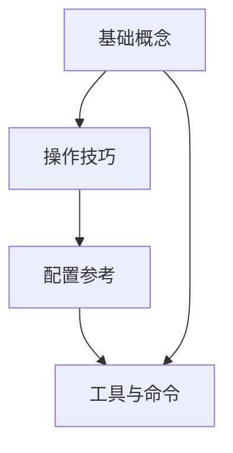

---
tags:
  - surf
  - index
  - kb
aliases:
  - Surf 知识库首页
---

# 🏄 Surf 知识库

> CS:S Surf 从入门到精通的完整知识体系

---

## 📂 知识结构



| 模块 | 说明 |
|------|------|
| [[01-基础概念/什么是Surf\|🏁 什么是Surf]] | 起源、玩法、术语 |
| [[01-基础概念/物理机制\|⚙️ 物理机制]] | 速度、坡度、摩擦等核心机制 |
| [[02-操作技巧/空移系统\|🕹️ 空移系统]] | Null Movement 原理与操作 |
| [[02-操作技巧/转向系统\|🔄 转向系统]] | Q/E 转向、yawspeed 详解 |
| [[02-操作技巧/大跳与跳跃技巧\|🦘 大跳与跳跃技巧]] | Crouchjump 及其他跳法 |
| [[03-配置参考/配置总览\|⚡ 配置总览]] | 全部 cfg 文件说明与对比 |
| [[03-配置参考/按键绑定速查\|⌨️ 按键绑定速查]] | 所有按键功能一览 |
| [[04-工具与命令/sm命令速查\|📋 sm 命令速查]] | 常用 sm_ 命令 |
| [[04-工具与命令/net_graph解读\|📊 net_graph 解读]] | 看懂网络参数 |

---

## 🎮 配置快速入口

| 文件 | 转向速度 | 用途 |
|------|---------|------|
| `surf110.cfg` | 低速 110 / 高速 293 | 普通 surf |
| `SURF210.cfg` | 低速 210 / 高速 293 | 需要更快转向的图 |
| `autoexec.cfg` | 低速 60 / 高速 293 | 通用启动配置 |
| `trikz.cfg` | 固定 210 | Trikz 模式专用 |

> 所有配置优化版存放于 `game configs/`，已部署到 `cstrike\cfg\`

---

## 🔧 核心操作逻辑

```
默认 → 🚀 高速 293（跑图）
跳  → 🐢 低速（空中精控）
R   → 🚀 高速（回存点后继续冲）
```

---

## 🗺️ 相关资源

- `[[game configs/CS:S_配置优化日志.md]]` — 详细改动记录
- `[[game configs/surf110.cfg]]` 等 — 优化版配置
